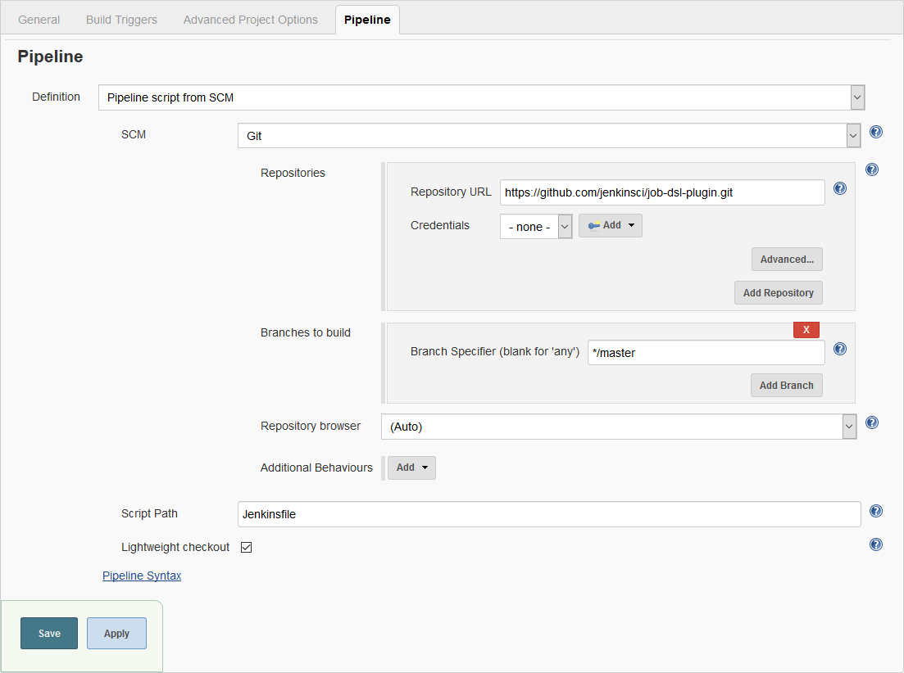
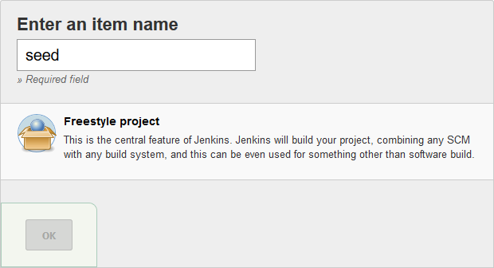
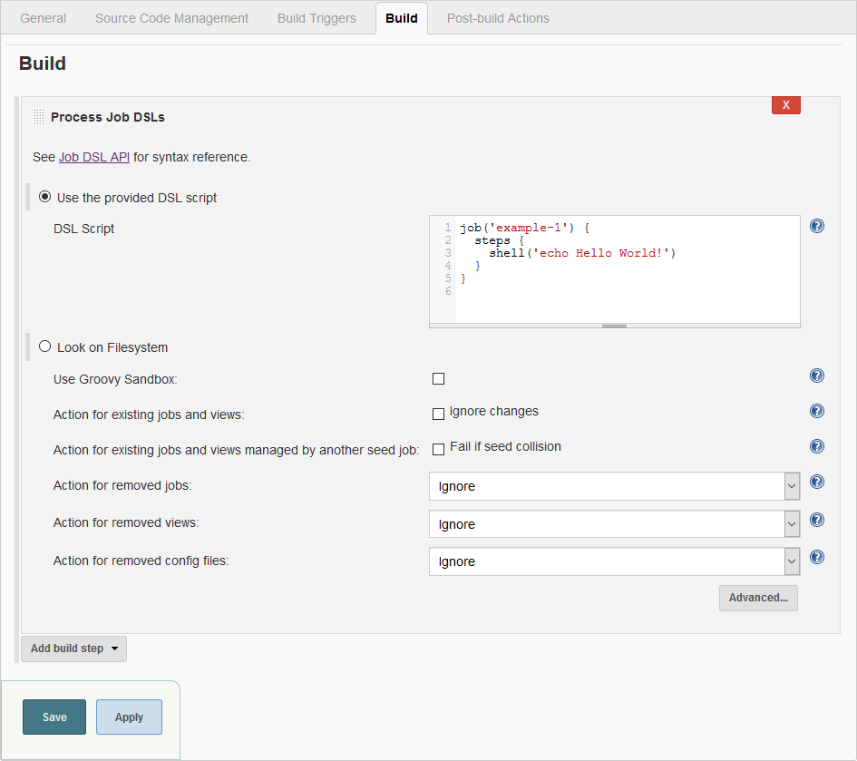
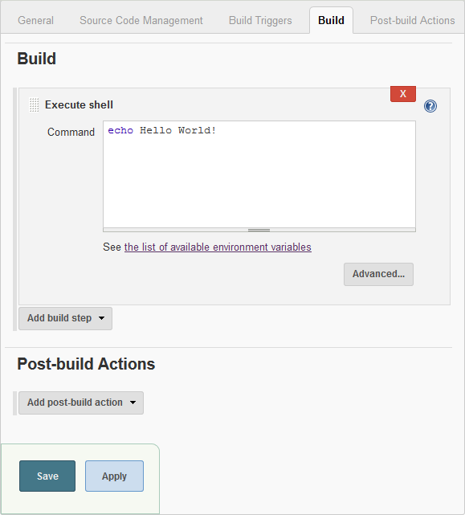

Jenkins Job DSL Plugin
======================

Introduction
------------

Jenkins is a wonderful system for managing builds, and people love using its UI to configure jobs. Unfortunately, as
the number of jobs grows, maintaining them becomes tedious, and the paradigm of using a UI falls apart. Additionally,
the common pattern in this situation is to copy jobs to create new ones, these "children" have a habit of
diverging from their original "template" and consequently it becomes difficult to maintain consistency between these
jobs.

The Job DSL plugin attempts to solve this problem by allowing jobs to be defined in a programmatic form in a human
readable file. Writing such a file is feasible without being a Jenkins expert as the configuration from the web UI
translates intuitively into code.

The job configuration above can be generated from the following code.

    pipelineJob('job-dsl-plugin') {
      definition {
        cpsScm {
          scm {
            git {
              remote {
                url('https://github.com/jenkinsci/job-dsl-plugin.git')
              }
              branch('*/master')
            }
          }
          lightweight()
        }
      }
    }

Job DSL was one of the first popular plugins for Jenkins which allows managing configuration as code and many other
plugins dealing with this aspect have been created since then, most notably the
[Jenkins Pipeline](https://jenkins.io/doc/book/pipeline/) and
[Configuration as Code](https://jenkins.io/projects/jcasc/) plugins. It is important to understand the differences
between these plugins and Job DSL for managing Jenkins configuration efficiently.

The Pipeline plugins support implementing and integrating continuous delivery pipelines via the Pipeline DSL. While it
is possible to use Job DSL to create complex pipelines using freestyle jobs in combination with many plugins from the
Jenkins ecosystem, creating and maintaining these pipeline, including generating jobs for individual SCM branches and
possibly running steps in parallel to improve build performance, poses a significant challenge. Jenkins Pipeline is
often the better choice for creating complex automated processes. Job DSL can be used to create Pipeline and Multibranch
Pipeline jobs. Do not confuse Job DSL with Pipeline DSL, both have their own syntax and scope of application.

The Configuration as Code plugin can be used to manage the global system configuration of Jenkins. It is comes with an
integration for Job DSL to create an initial set of jobs.

Getting Started
---------------

First, start a Jenkins instance with the Job DSL plugin installed.

Then create a freestyle project named "seed".

Add a "Process Job DSLs" build step and paste the script below into the "DSL Script" field.

    job('example') {
      steps {
        shell('echo Hello World!')
      }
    }

When running Jenkins on Windows, replace the `shell` step by a `batchFile` step.

    job('example') {
      steps {
        batchFile('echo Hello World!')
      }
    }

Save the configuration, start a build and inspect the console output.

    Started by user admin
    Running as SYSTEM
    Building in workspace /var/jenkins_home/workspace/seed
    Processing provided DSL script
    Added items:
        GeneratedJob{name='example'}
    Finished: SUCCESS

The seed job has generated the "example" job. Verify the result on the job's configuration page.

Instead of creating a seed job manually, consider using the
[Configuration as Code](https://plugins.jenkins.io/configuration-as-code) plugin. See the
[Wiki](https://github.com/jenkinsci/job-dsl-plugin/wiki/JCasC) for details.

Documentation
-------------

The complete DSL API reference is available in your Jenkins installation at
`https://your.jenkins.installation/plugin/job-dsl/api-viewer/index.html`. You can find links to the API reference on the
seed job page and the Job DSL build step.

A limited sub-set of the API reference is available online at https://jenkinsci.github.io/job-dsl-plugin/. But be aware
that this does not show all API that is available in your Jenkins installation because a lot of the documentation is
generated at runtime by introspecting the plugins that have been installed.

Jenkins saves the configuration of each job in a XML file. The Job DSL plugin is in principle a generator for these XML
files, translating the DSL code into XML. If a configuration option is not available in the high-level DSL, it is
possible to generate the XML directly using a
[Configure Block](https://github.com/jenkinsci/job-dsl-plugin/wiki/The-Configure-Block). Use the
[Job DSL Playground](http://job-dsl.herokuapp.com/) to create and test your configure blocks. Please note that the
playground only supports the DSL API that is available in the online
[API Reference](https://jenkinsci.github.io/job-dsl-plugin/).

Find the complete documentation on the [Wiki](https://github.com/jenkinsci/job-dsl-plugin/wiki).

Release Notes
-------------

See the [Wiki](https://github.com/jenkinsci/job-dsl-plugin/wiki#release-notes).

Community
---------

Browse the collection of [talks and blog posts](https://github.com/jenkinsci/job-dsl-plugin/wiki/Talks-and-Blog-Posts)
about Job DSL. If you have a talk or blog post to share, please raise a hand, e.g. by posting to the
[mailing list](https://groups.google.com/d/forum/job-dsl-plugin).

Head over to [Stack Overflow](https://stackoverflow.com/questions/tagged/jenkins-job-dsl) or the
[mailing list](https://groups.google.com/d/forum/job-dsl-plugin) to get help.

Use the [Issue Tracker](https://issues.jenkins-ci.org/secure/Dashboard.jspa?selectPageId=15341) for reporting bugs and
making feature requests. Select the `job-dsl-plugin` component when searching or creating issues.

You can actively help to improve Job DSL by contributing code, documentation and tests or by reviewing and testing
upcoming changes on [GitHub](https://github.com/jenkinsci/job-dsl-plugin). Start by reading the
[guidelines for contributors](https://github.com/jenkinsci/job-dsl-plugin/blob/master/CONTRIBUTING.md).

Please use the [mailing list](https://groups.google.com/d/forum/job-dsl-plugin) to provide feedback.
